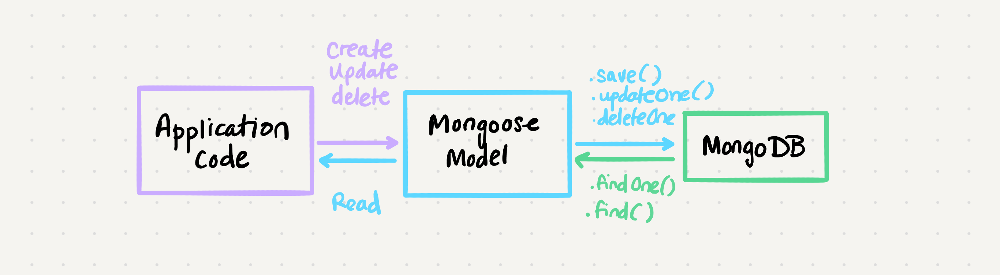

# Class 04 --- Advanced Mongo/Mongoose

## Lecture Videos

[Tuesday](https://www.youtube.com/watch?v=_RknmdEkzQ0) || [Wednesday](https://www.youtube.com/watch?v=Xkfo17-YPP0)

## Lecture Overview

We've been introduced to MongoDB and the package Mongoose, but now it's time to dive in further. At the end of this class, you'll be able to:

-   [x] Understand testing strategies for databases
-   [x] Understand what a test mock is
-   [x] Understand the full extent of CRUD functionality through Mongoose methods
-   [x] Understand what interfaces and collections are
-   [x] Understand standard mongo CLI commands
-   [x] Be able to create a Mongoose schema
-   [x] Be able to create an interface for Mongoose CRUD operations
-   [x] Test code that relies on a database

Prior to class, review the readings below and answer the discussion questions in your reading repository.

## Reading

So far, we've gotten an introduction to NoSQL databases through MongoDB and the helper package, Mongoose. We used Mongoose schemas to help validate our data, and we've learned the basic CRUD operations.

When learning the CRUD operations (create, read, update, delete), what we were actually learning was an **interface** for our database operations. An interface is a simplified way to enact more complex operations. For example, when we want to create something in our database, we might have to format our data in a certain way, run some validation upon it, and then call `.save()`. Wouldn't it be nicer if the raw data could be just sent to a simple `create()` function that did all that for us? In this situation, we would have a `create()` interface for the create operation.

Interfaces can be very helpful in standardizing how certain operations are called, and allowing for operations to be largely changed without the code having to be changed too much. The contents of `create()` can be changed to have more steps, or different steps alltogether, but we don't have to look through our code and change every reference to `create()`. The interface stays the same even when the implementation changes. Imagine if you had to find every part of your code that called `.save()` and change 10 lines around that command every time!

```javascript
let rawData = {...};

// create without an interface
// assume this block of 4 lines was used in 100 places
// within your application
format(rawData);
validate(rawData);
let newRecord = new schema(rawData);
await newRecord.save();
```

```javascript
let rawData = {...};

// create using an interface
let model = new Model();
await model.create(rawData);

// now we can easily change our interface and
// all of our code updates
class Model {
  ...
  async create() {
    format(data);
  	validate(data);
  	let newRecord = new schema(data);
  	await newRecord.save();
  }
};
```

In this class, we're going to be talking about mongoose **middleware**, and how it can add another layer to our data manipulation. Middleware typically means "software between two other softwares" - you can think of it as a middleman between two operations that helps the process go more smoothly. When thinking of our application and our database, conceptually mongoose can already be viewed as middleware:



Mongoose itself has additional middleware options for actions between the application code and mongoose model, or between the mongoose model and MongoDB.

With the power of middleware, we can have a lot more control upon the data flow timeline. We can make sure that at every step of the way we have some ability for custom actions.

Testing can be a challenge with databases, since we don't ever want to modify our actual database when we run our tests. For example, we might have a test that tries to delete some data - we would never want this to affect our actual database! Because of this, when testing databases, we usually create a fake or "**mock**" database to run our tests upon.

This mock database has the same structure as our application database. It has the same data models and commands. The only difference is that this mock database only exists during the lifetime of the test: it is created and initialized when we start our tests and deleted when tests are complete. We give this mock database some dummy data to initialize with as well, and thus we can be confident that any secure and application related data is not messed with when testing.

### External Reading / Viewing

Save or skim through the following links to help broaden your understanding.

| Links                                                                                                                 |
| --------------------------------------------------------------------------------------------------------------------- |
| [Testing Node.js + Mongoose](https://dev.to/paulasantamaria/testing-node-js-mongoose-with-an-in-memory-database-32np) |
| [Repository Design Pattern](https://cubettech.com/resources/blog/introduction-to-repository-design-pattern/)          |
| [NPM MongoDB-Memory-Server](https://www.npmjs.com/package/mongodb-memory-server)                                      |
| [NPM Supergoose](https://www.npmjs.com/package/@code-fellows/supergoose)                                              |
| [Mongoose Middleware Docs](https://mongoosejs.com/docs/middleware.html)                                               |
| [Compass](https://www.mongodb.com/products/compass)                                                                   |

### Vocabulary

Familiarize yourself with the following vocabulary terms. We will be covering their definitions in class.

| Term       |
| ---------- |
| mock       |
| middleware |
| supergoose |
| pre hook   |
| post hook  |
| in-memory  |
| interface  |

### Handy Code Snippets

Feel free to skim these code snippets, they are mainly here for your reference after class lectures.

#### Interface Design

```javascript
// Generic Model (also called Persistence Model)

class Model {
    constructor(schema) {
        this.schema = schema;
    }

    create(record) {}
    read(id) {}
    update(id, newRecord) {}
    delete(id) {}
}
```

```javascript
// Specific Model
let notesSchema = {/* */};

class Notes extends Model {
  constructor() {
    super(notesSchema);
  }

	readAllNotes() {}
	filterNotes(filter) {}
	...
}
```

#### Mongoose Pre and Post Hooks

```javascript
const schema = mongoose.Schema({
    /* */
});

schema.pre('save', function() {
    // runs before the 'save' operation
});

schema.post('findOne', function() {
    // runs after the 'findOne' operation
});
```

#### Mongoose Pre and Post Hooks `this`

For different Mongoose operations, the keyword `this` can either refer to an individual document/record, or the query being used to filter the documents/records in a collection. Here's a handy table for which commands are document-based and query-based.

| Mongoose Command | Within hook, `this` refers to...                                                                                                                       |
| ---------------- | ------------------------------------------------------------------------------------------------------------------------------------------------------ |
| `save()`         | The document being saved                                                                                                                               |
| `remove()`       | The document being removed                                                                                                                             |
| `updateOne()`    | Either document or query, use `{ document: true }` or `{query: true}` to specify <br />`schema.pre('updateOne', { document: true }, function() {...})` |
| `deleteOne()`    | Either document or query, use `{ document: true }` or `{query: true}` to specify <br />`schema.pre('deleteOne', { document: true }, function() {...})` |
| `count()`        | The query of what should be counted                                                                                                                    |
| `deleteMany()`   | The query of what should be deleted                                                                                                                    |
| `find()`         | The query of what should be found                                                                                                                      |
| `findOne()`      | The query of what should be found                                                                                                                      |
| `update()`       | The query of what should be updated                                                                                                                    |
| `updateMany()`   | The query of what should be updated                                                                                                                    |

#### Mock Database Testing

```javascript
const supergoose = require('supergoose');
const DataModel = require('./data-model.js');

// === Mock Database Setup ============================================
// This portion of your test code is here to set up your
// mock database with some initial entries.

let sampleData = {
    sample01: {
        /* */
    },
    /* */
};

let model = new DataModel();

beforeAll(async done => {
    await supergoose.startDB();
    const sampleRecord = await model.create(sampleData.sample01);
    done();
});

afterAll(supergoose.stopDB);
```

## Discussion Questions

Create a new markdown page in your reading notes repo for this class. On that page, answer the following questions. You will not be graded on correctness, but rather on your attempt to answer the question. Once you've created your new page, submit a link to that page using the canvas discussion entry field. Links should be somewhat of the format `https://USERNAME.github.io/reading-notes/class-##-reading`.

1. What makes an interface useful?
2. Why is middleware called middleware?
3. Fundamentally, what does it mean to have a mock of something? Why is this useful?
4. What does it mean to have a mock database?
