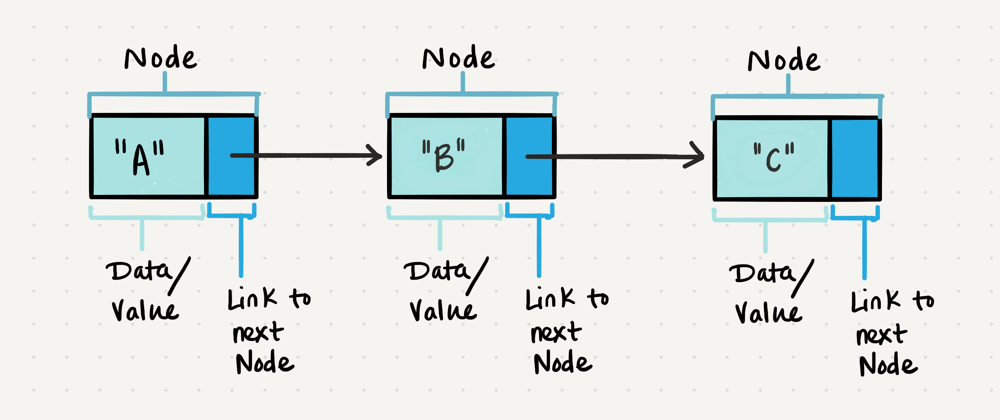
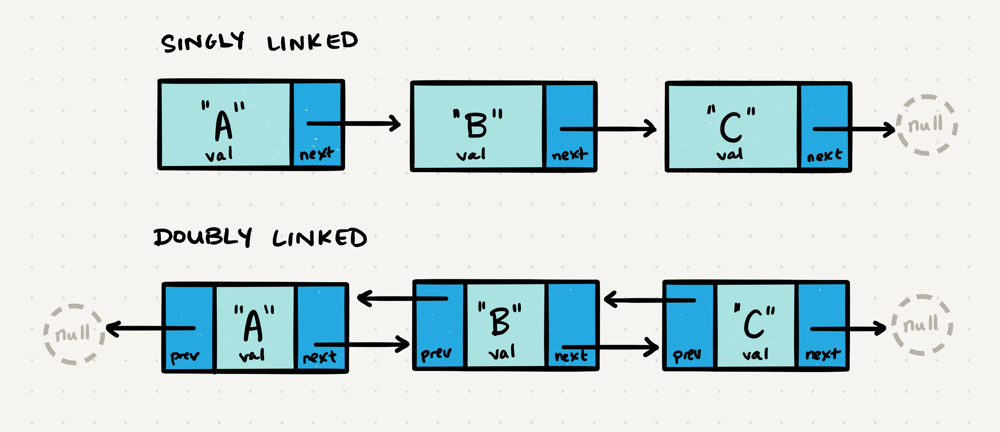
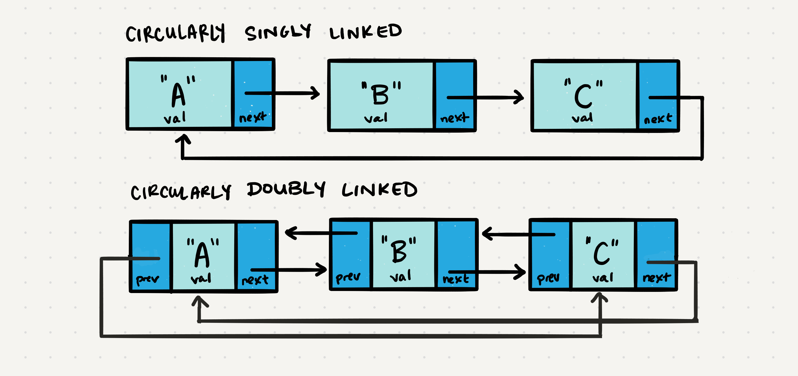

# Class 05 --- DSA: Linked Lists

## Lecture Videos

[Saturday Morning](https://www.youtube.com/watch?v=0H_MAP2TbZQ) || [Saturday Afternoon](https://www.youtube.com/watch?v=8_rfdRKYdTc)

## Lecture Overview

In the past four classes, we've covered the major topics for our first course module: JavaScript Fundamentals and Data Models. As we take time to review the topics we've learned in class, we'll also be diving into our first data structure discussion. Data structures are a crucial piece of programming to learn, and today we'll be focusing on Linked Lists. At the end of this class, you'll be able to:

-   [x] Define what a data structure is
-   [x] Define what a linked list is
-   [x] Understand Big-O and why it is important
-   [x] Write a linked list data structure from scratch
-   [x] Have a solid understanding of past module topics such as:
    -   [x] Test Driven Development
    -   [x] UML Diagram creation
    -   [x] Continuous Integration / Continuous Deployment
    -   [x] Data Modeling and Validation
    -   [x] Objects and Classes
    -   [x] Asynchronous code, Promises and Async/Await
    -   [x] MongoDB and Mongoose

Prior to class, review the readings below and answer the discussion questions in your reading repository.

## Reading

In order to understand Linked Lists, you must first understand what a `Node` is. This `Node` is quite different from the Node.js package you've been using; instead it is a programming _concept_ that is fundamental to many data structures. A `Node` represents a piece of data in a data structure, similar to an index in an array or a letter in a string. Because data structures can contain any kind of data (even instances of classes), we generalize a piece of data in the structure as a "`Node`". In the terms of JavaScript code, this is really just a variable with some data!

A Linked List is a sequence of `Nodes` that are connected, or "linked", to each other. Each `Node` in a Linked List contains some data, as well as a _reference_ or "link" to another `Node` in the list (either the previous `Node`, the next `Node`, or both).



Linked Lists may look conceptually like arrays, but they are in fact quite different. An array tends to be more rigid; adding to an array or deleting from an array can be costly. In modern languages like JavaScript, developers don't usually have to worry about that cost. However, in older languages like Java and C++, arrays do not easily change size. Linked Lists can be a nice alternative in those languages, since it is quite easy to add or remove `Nodes`.

Typically, a standard Linked List is **singly linked**, meaning each `Node` in the list only maintains a link to the next `Node` in the list, often called `next`. You can have a **doubly linked** list, which means that each `Node` holds a link to the next AND previous `Nodes` in the list, often called `next` and `prev`. Doubly Linked Lists can be quite beneficial since they allow you to move forward and backward through the Linked List. Singly Linked Lists, however, can only move from left to right.



When discussing Linked Lists, we often refer to the first `Node` in the list as the `head`, and the last `Node` as the `tail`. The most common operation upon a Linked List is a _traversal_: moving from the `head` to the `tail`.

The best way to approach a traversal is through the use of a `while()` loop. This allows us to continually check that the `next` node in the list is not `null`. If we accidentally end up trying to traverse on a node that is `null`, a `NullReferenceException` gets thrown and our program will crash.

When traversing through a linked list, the `current` node is the most helpful. The `current` will tell us
where exactly in the linked list we are and will allow us to traverse forward until we hit the end (a `Node` where the `next` property is `null`).

Let's put a use case on our traversal. We want to check whether or not our LinkedList `includes` a specific value. The pseudocode for this function `includes` might be something like:

```javascript
ALGORITHM includes (searchVal)
	// INPUT  <-- integer value
	// OUTPUT <-- boolean

	current <-- head

	WHILE current is not NULL
		IF current.val is equal to searchVal
			return TRUE

		current <-- current.next

	return FALSE
```

Let's talk out what exactly is happening. We start off our algorithm by setting `current` equal to the `head` of the Linked List. This basically means that we're starting our search from the beginning of the list.

Then, we start a `while` loop, that checks to make sure our `current` `Node` is not `null`. This is to ensure that we're looking at a valid `Node` while within the loop. Once within the loop, we check the value of `current`. If it's our `searchVal`, then we know that our Linked List includes `searchVal` and we can end the algorithm with a return value of `true`.

Otherwise, we want to continue our traversal of the list, and we do that by setting `current` to be the `next` `Node` in the list. Then we repeat the above process until `current` is `null`. At that point, we have not seen `searchVal` anywhere in our Linked List, so we can safely return `false`.

Traversals like this will work perfectly fine, except in cases where the list is **circularly linked**. A Linked List that is circularly linked will never have a `Node` with a `next` property equal to `null`:



For traversals upon circularly Linked Lists, we need to be mindful of our `head` `Node`, to ensure that we're not visiting twice. Circularly Linked Lists can be useful; they allow you to traverse the whole list regardless of what `Node` you start at. Later on, we'll expand this idea of circular linking when we look at the data structure called Graphs.

### External Reading / Viewing

Save or skim through the following links to help broaden your understanding.

| Links                                                                                                                                      |
| ------------------------------------------------------------------------------------------------------------------------------------------ |
| [What's a Linked List Anyway? Part 01](https://medium.com/basecs/whats-a-linked-list-anyway-part-1-d8b7e6508b9d)                           |
| [What's a Linked List Anyway? Part 02](https://medium.com/basecs/whats-a-linked-list-anyway-part-2-131d96f71996)                           |
| [Data Structures: Linked List](https://www.youtube.com/watch?v=njTh_OwMljA)                                                                |
| [Big-O CheatSheet](https://www.bigocheatsheet.com/)                                                                                        |
| [A Simplified Explanation of Big O Notation](https://medium.com/karuna-sehgal/a-simplified-explanation-of-the-big-o-notation-82523585e835) |

### Vocabulary

Familiarize yourself with the following vocabulary terms. We will be covering their definitions in class.

| Term              |
| ----------------- |
| Linked List       |
| Singly Linked     |
| Doubly Linked     |
| `Node`            |
| `next`            |
| `prev`            |
| `val`             |
| `current`         |
| `head`            |
| Circularly Linked |
| Big-O             |

### Handy Code Snippets

Feel free to skim these code snippets, they are mainly here for your reference after class lectures.

#### Traversal Pseudocode

```javascript
ALGORITHM includes (searchVal)
	// INPUT  <-- integer value
	// OUTPUT <-- boolean

	current <-- head

	WHILE current is not NULL
		IF current.val is equal to searchVal
			return TRUE

		current <-- current.next

	return FALSE
```

#### Add Operation Pseudocode

```javascript
ALGORITHM addToStart(newNode)
	// INPUT  <-- Node to add
  // OUTPUT <-- No output

	newNode.next <-- head
	head <-- newNode
```

```javascript
ALGORITHM addBeforeNode(newNode, existingNode)
	// INPUT  <-- Node to add, existing node in list to add new node before
  // OUTPUT <-- No output

	current <-- head

	while current.next is not equal to NULL

  	if current.next.val is equal to existingNode.val
			newNode.next <-- existingNode
			current.next <-- newNode

		current <-- current.next
```

#### Print Nodes Pseudocode

```javascript
ALGORITHM print()
	// INPUT  <-- None
	// OUTPUT <-- string to console

	current <-- head

	while current.next is not equal to NULL
		OUTPUT <-- current.val
		current <-- current.next
```

## Discussion Questions

Create a new markdown page in your reading notes repo for this class. On that page, answer the following questions. You will not be graded on correctness, but rather on your attempt to answer the question. Once you've created your new page, submit a link to that page using the canvas discussion entry field. Links should be somewhat of the format `https://USERNAME.github.io/reading-notes/class-##-reading`.

1. What is a data structure?
2. How is a Linked List different from an array?
3. What is one benefit a Linked List has over an array?
4. What data does a `Node` hold in a doubly Linked List?
5. What would you use to implement a Linked List data type? (object, function, class, variable...?)
