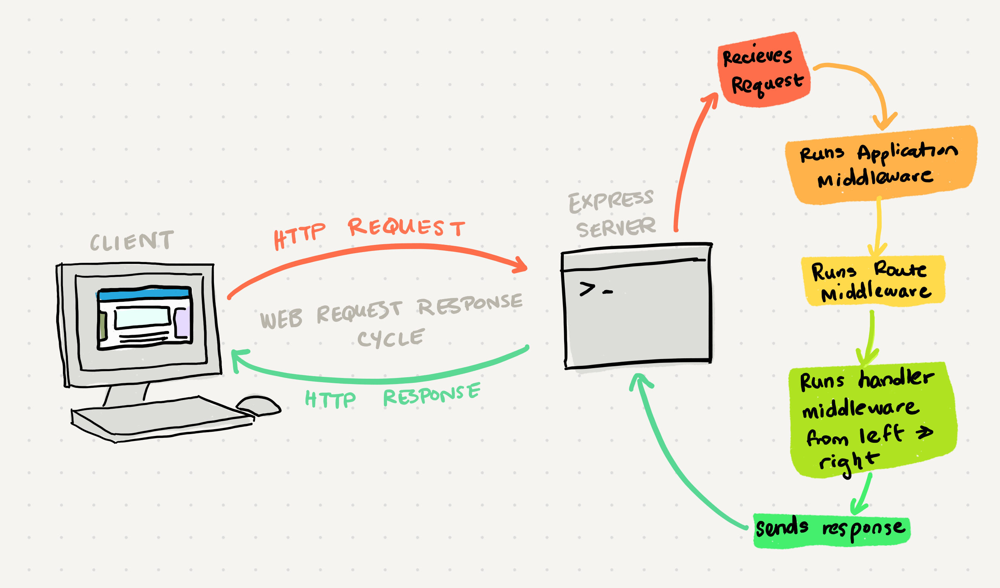

# Class 07 --- Express

## Lecture Videos

[Saturday Morning](https://www.youtube.com/watch?v=jSD_dS7712k) || [Saturday Afternoon](https://www.youtube.com/watch?v=uPepr8lQWsw) || [Saturday Evening](https://www.youtube.com/watch?v=uYUQJ9l5LlE)

## Lecture Overview

As we move deeper into our understanding of web APIs, it's time to begin fully writing our own. While `json-server` helped us get set up with a web API very quickly, it's an incredibly limited package and only works with JSON data instead of our MongoDB database. So, we're going to learn how to achieve the functionality of `json-server` on our own, while also integrating our web API server with a MongoDB database. To do all of this, we'll be utilizing another package, `express`.

At the end of this class, you'll be able to:

-   [x] Understand HTTP Status Codes and their meanings
-   [x] Be able to write Express middleware
-   [x] Understand Express routing
-   [x] Understand how to implement CRUD operations using REST
-   [x] Write an Express API server
-   [x] Properly test an Express server

Prior to class, review the readings below and answer the discussion questions in your reading repository.

## Reading

In our last class, we ran a web server using the package `json-server`. Any code that runs on a server is meant to be run indefinitely; to always be accessible by clients requesting data. Let's see how we can build our server from the ground up, instead of relying on `json-server`.

Building a server can be a daunting and tedious task, but luckily there is a widely-used package that helps ease the process. This package is `express`, and it provides a lot of tools for building, customizing and maintaining a web server.

Express allows us to create our own specific **endpoints** for our client to request from. We can define `GET`, `POST`, `PUT` and `DELETE` urls as well as what code is executed when a request to that endpoint is received.

Express is inherently an **event-driven system**. While running, an express server doesn't actually do anything, instead it waits for events to fire and then responds to those events. For example, an event is usually a received request from a client. When defining our server, what we're really defining are handlers for different types of events.

If a client wanted to get a resource, and made a request to `GET /products`, our express server might define a handler that looks like:

```javascript
let myProducts = [
    { name: 'chair', cost: 34, category: 'furniture' },
    { name: 'notebook', cost: 5, category: 'office' },
];

app.get('/products', (request, response) => {
    console.log('received a request to GET products');

    // send an array of products as the response to the client
    response.send(myProducts);
});
```

There's a lot going on in this code, so let's break it down. Firstly, we have a sample data array defined as `myProducts`. Then we start defining a handler for a specific type of event:

```javascript
app.get('/products', (request, response) => {
    //...
});
```

Here, `app` is a reference to the server we're building. The `.get` specifies that we want to create a handler for an HTTP `GET` command. The string `/products` specifies that this handler should only be entered if the url for the `GET` request was `/products`. Finally, we provide the actual handler function, with two parameters `request` and `response`.

Both of these parameters are objects, with the `request` object containing all the information sent from the client, and the `response` object being something generated by the server in order to help send a response to the client.

The `request` object (often abbreviated to `req`) typically contains:

-   Any parameters the client sent in the url, such as a possible record ID

    `app.get('/products/:id', ...)` will allow us to access `:id` by referencing `request.params.id`

-   Any query strings the client sent in the url

    `http://server/products?cat=office` sent by the client is accessible by the server when accessing `request.query.cat`

The `response` object (often abbreviated to `res`) typically contains:

-   The method `send()` which is used to send data back to the client in the properly formatted way
-   The method `status()` which is used to set the HTTP status code for the response the client receives

When building out our handler functions (often referred to as our **endpoints**), there's a lot we can do. The handler functions can contain any code we wish, but sometimes it's helpful to modularize that code. What if you wanted to break your one large handler function into 5 sepearate functions that are meant to be executed in a specific order? This is where Express **middleware** comes in.

Express middleware is just a function that is called. What makes it "middleware" is that this function is called in-between the received request and returned response.



As shown in the diagram above, Express has three kinds of middleware:

-   Application Middleware
    -   Run whenever the server receives a request
    -   Useful for generic server actions like JSON parsing, error handling, etc.
    -   Can be set to run only when a request belongs to a specific method (`GET`, `POST`, `PUT`, `DELETE`)
-   Route Middleware
    -   Runs whenever the server receives a request to a specific url endpoint
    -   Will execute for any method request on that route (`GET`, `POST`, `PUT`, `DELETE`)
    -   Useful for authentication, authorization, etc.
-   Handler Middleware
    -   Runs when the server receives a specific method request (`GET`, `POST`, `PUT`, `DELETE`) to a specific route
    -   The handler allows you to provide a list of functions
    -   This list is exectued from left to right

"Handler Middleware" is often the least referred to as "middleware", though it operates in a similar pattern. With this collection of middleware, developers can have a lot of control over how their server responds to different kinds of requests. Express truly enables JavaScript developers to create a complex and efficient web server in a short amount of time!

### External Reading / Viewing

Save or skim through the following links to help broaden your understanding.

| Links                                                                                   |
| --------------------------------------------------------------------------------------- |
| [Express Middleware Explained](https://www.youtube.com/watch?v=9HOem0amlyg)             |
| [Using Express Middleware](https://expressjs.com/en/guide/using-middleware.html)        |
| [Express Middleware](https://www.tutorialspoint.com/expressjs/expressjs_middleware.htm) |
| [Using Express Routing](https://expressjs.com/en/guide/routing.html)                    |
| [Supertest](https://github.com/visionmedia/supertest)                                   |
| [Express Middleware List](https://expressjs.com/en/resources/middleware.html)           |
| [HTTP Status Codes](https://www.restapitutorial.com/httpstatuscodes.html)               |

### Vocabulary

Familiarize yourself with the following vocabulary terms. We will be covering their definitions in class.

| Term                   |
| ---------------------- |
| Express                |
| endpoint               |
| routing                |
| query                  |
| event                  |
| application middleware |
| route middleware       |
| error middleware       |

### Handy Code Snippets

Feel free to skim these code snippets, they are mainly here for your reference after class lectures.

#### CRUD Operations as Endpoints

```javascript
app.post('/products', (req, res) => {
    // CREATE PRODUCT
});

app.get('/products', (req, res) => {
    // READ PRODUCTS
});

app.put('/products/:id', (req, res) => {
    // UPDATE PRODUCT WITH ID req.params.id
});

app.delete('/products/:id', (req, res) => {
    // DELETE PRODUCT WITH ID req.params.id
});
```

#### Application Middleware

```JavaScript
app.use( (req, res, next) => {
	// application middleware code
	// this code runs for EVERY request from ANY client

	// call the next middleware in the chain
  next();
});
```

#### Application Error Middleware

Raising an error:

```JavaScript
next('error object');
```

Creating an error handler:

```javascript
app.use((err, req, res, next) => {
    // executes every time an error is raised
});
```

#### Handler Middleware

```JavaScript
const first = (req, res, next) => {
  // the first handler middleware function to run
  next();
}

const last = (req, res, next) => {
  // the last handler middleware function to run
  res.send();
}

// executes from left to right
app.get('/products', first, last);
```

## Discussion Questions

Create a new markdown page in your reading notes repo for this class. On that page, answer the following questions. You will not be graded on correctness, but rather on your attempt to answer the question. Once you've created your new page, submit a link to that page using the canvas discussion entry field. Links should be somewhat of the format `https://USERNAME.github.io/reading-notes/class-##-reading`.

1. What code does the server actually run?
2. What Express/HTTP operations map to CRUD operations?
3. What does `res.send()` do?
4. What is the order of operations for the three categories of middleware (handler, application, route)?
5. What is the parameter `next` used for?
