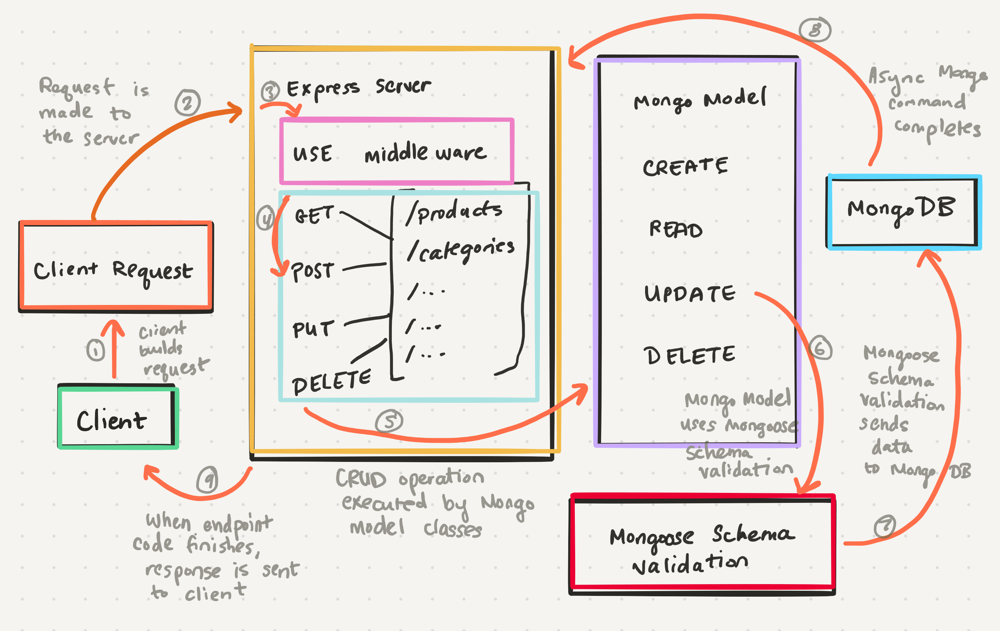

# Class 08 --- Express Routing & Connected API

## Lecture Videos

[Tuesday](https://www.youtube.com/watch?v=LVcGPDh2mqE) || [Wednesday](https://www.youtube.com/watch?v=yImo5aNDjjA)

## Lecture Overview

In our last class, we built our first Express server. In this class, we'll expand upon that even further, modularizing our `server.js` file, integrating our server with MongoDB, and using more features of the request object. 

At the end of this class, you'll be able to:

-   [x] Describe modular routing with Express
-   [x] Build an API server that connects to a Mongo database
-   [x] Use models and schemas to perform CRUD operations 
-   [x] Respond to request queries and parameters in routes 

Prior to class, review the readings below and answer the discussion questions in your reading repository.

## Reading

In this class, we're going to bring together concepts from Module 01, and we're going to improve upon our Express server even further. When we think about our server, should start blocking off what is a client endpoint, what is a data operation, and what is middleware. This helps us tackle each respective piece independently without too much chaos in between. 

Remember, one thing we learned in our last class is that Express executes code from top to bottom. This means that even though Application Middleware is typically meant to be run before Handler Middleware, you can change this by moving an Application Middleware assignment *after* a Handler Middleware assignment. Keep in mind this top-down order when writing your Express servers! 

In Express, you can move route handler definitions to different files, and then "use" them in your main server just like you would middleware. For example, you can move something like this: 

```javascript
// server.js

app.get('/products', (req, res, next) => {
  // ...
}); 

app.post('/products', (req, res, next) => {
  // ...
}); 

app.get('/categories', (req, res, next) => {
  // ...
});

app.post('/categories', (req, res, next) => {
  // ...
}); 
```

Into separate individual files that house only handlers for each major routing branch: 

```javascript
// routes/products.js

const productRouter = express.Router(); 

productRouter.get('/', (req, res, next) => {
  // ...
}); 

productRouter.post('/', (req, res, next) => {
  // ...
}); 

module.exports = productRouter; 
```

```javascript
// routes/categories.js

const categoriesRouter = express.Router(); 

categoriesRouter.get('/', (req, res, next) => {
  // ...
}); 

categoriesRouter.post('/', (req, res, next) => {
  // ...
}); 

module.exports = categoriesRouter; 
```

```javascript
// server.js

const products = require('./routes/products.js'); 
const categories = require('./routes/categories.js'); 

app.use('products', products); 
app.use('categories', categories); 
```

As you can see, this allows us to modularize our routes very easily. Our server files will continue to get larger, and so this modularization can save a lot of headache! 

You can even specify middleware that should only act upon a certain route, such as the line below which will only execute the specified middleware when any request to the `/products` path (or any sub-paths) is made.

```javascript
productsRouter.use(middleware)
```

Now, when we put everything together and actually make data changes, we'll have to keep track of how the flow of information passes from the initial client request to the final client response. Take a look at the diagram below: 



There's a lot going on here! Let's tackle each step based on the numerical markings above: 

1. First, the client must build a request and send that off to a server. Clients can use many tools such as fetch, axios or SuperAgent to properly build and format a request. 
2. The properly formatted HTTP-compliant request is sent to our Express server, which should hopefully be live and running in order to accept that request. 
3. The server runs any pre-emptive middleware for the application or specific route. This middleware is usually modularized into discrete files, typically located in a `/middleware` folder. 
4. The server then runs the specific route + method handler middleware functions. Using `express.Router()`, we can now modularize these as well into discrete files, typically located in a `/routes` folder.
5. When running the handler middleware, there is a strong likelyhood that some data operation needs to take place. The handler function kicks off this asynchronous data operation by calling a model function such as `create()`, `read()`, `update()` or `delete()`. This refers to a model class built in a `/models` folder, utilizing a schema also defined in the `/models` folder. The handler then `awaits` this data operation to complete
6. The model CRUD functions themselves call MongoDB specific commands such as `save()`, `find()`, etc. This triggers the Mongoose schema to be called.  
7. The Mongoose schema runs any `pre`middleware, does any schema validation, and sends things off to the actual MongoDB database. 
8. After the MongoDB database makes the final data operation within the data store, the Mongoose schema can run its `post` middleware and then the async action can be marked as complete, with the Promise being resolved. Thus, the Express handler function is able to continue onwards, receiving some data from MongoDB. 
9. Having received some proof that the data operation was completed either successfully or unsuccessfully, the Express handler function can send a response to the client, setting the response status code and the response body to the expected data values. 

By the end of this class, you'll be tasked to implement an application that mimics this data flow. Try to keep files small and modular, and refer back to this diagram to understand how the pieces interact. 

### External Reading / Viewing

Save or skim through the following links to help broaden your understanding.

| Links                                                        |
| ------------------------------------------------------------ |
| [Using Express Routing](https://expressjs.com/en/guide/routing.html) |
| [Express Routing](https://scotch.io/tutorials/learn-to-use-the-new-router-in-expressjs-4) |

### Handy Code Snippets

Feel free to skim these code snippets, they are mainly here for your reference after class lectures.

#### Creating a Modular Route 

```javascript
const express = require('express'); 
const router = express.Router(); 

router.get('/', (req, res, next) => {
  // ...
}); 

module.exports = router; 
```

#### Using a Modular Route

```javascript
const products = require('./routes/products.js')

app.use(products); 
```

#### Giving a Modular Route a Custom Path Prefix

```javascript
const products = require('./routes/products.js'); 

app.use('/products', products); 
```

## Discussion Questions

Create a new markdown page in your reading notes repo for this class. On that page, answer the following questions. You will not be graded on correctness, but rather on your attempt to answer the question. Once you've created your new page, submit a link to that page using the canvas discussion entry field. Links should be somewhat of the format `https://USERNAME.github.io/reading-notes/class-##-reading`.

1. What is a benefit to using `express.Router()`? 
2. When I say that top-down order matters in Express, what does that mean? 
3. Why do we use a model class (with `create()`, `read()`, etc.) instead of directly calling MongoDB operations (such as `save()`, `find()`, etc.) within our Express route handlers? 

