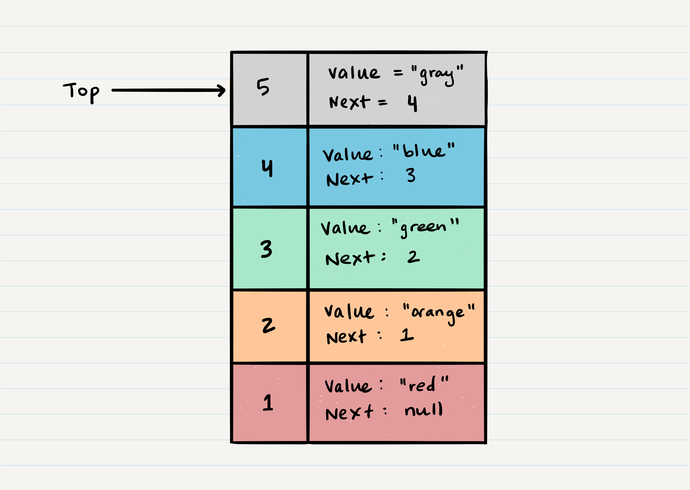

# Class 11 --- DSA: Stacks and Queues

## Lecture Videos

[Saturday Morning](https://www.youtube.com/watch?v=rzc_DW29ESg) || [Saturday Afternoon](https://www.youtube.com/watch?v=PcCiyknTuX4)

## Lecture Overview

In classes 06-09, we've covered the major topics for our second course module: Web APIs. As we take time to review the topics we've learned in class, we'll also be diving into our second data structure discussion. Data structures are a crucial piece of programming to learn, and today we'll be focusing on two data structures; Stacks and Queues. At the end of this class, you'll be able to:

-   [x] Define what a data structure is
-   [x] Define what a stack is
-   [x] Define what a queue is
-   [x] Understand `pop` and `push` actions
-   [x] Understand `queue` and `dequeue` actions
-   [x] Write a stack and queue data structure from scratch
-   [x] Have a solid understanding of past module topics such as:
    -   [x] The Web Request Response Cycle
    -   [x] Swagger API documentation
    -   [x] Express servers
    -   [x] Express middleware
    -   [x] Express routing
    -   [x] Connecting MongoDB to Express

Prior to class, review the readings below and answer the discussion questions in your reading repository.

## Reading

A **stack** is yet another data structure that consists of `Nodes`, however it differs largely from a linked list in that it is mostly meant for temporary storage instead of long-term storage or traversal.

Here's an example of what a stack looks like. As you can see, the topmost item is denoted as the `top`. When you push something to the stack, it becomes the new `top`. When you pop something from the stack, you pop the current `top` and set the next `top` as `top.next`.


Common terminology for a stack is

-   `push` - a `Node` is put onto the top of the stack
-   `pop` - a `Node` is removed from the top of the stack
-   `top` - the last-added or topmost `Node` in the data structure
-   `peek` - an action where you look at the value of the top `Node` without removing that `Node` from the data structure

Stacks follow the concepts of **First In Last Out (FILO)**, or **Last In First Out (LIFO)**. This means that the first item added in the stack will be the last item popped out of the stack and that the last item added to the stack will be the first item popped out of the stack.

Pushing a `Node` onto a stack will always be an `O(1)` operation. This is because it takes the same amount of time no matter how many Nodes (`n`) you have in the stack. When adding a Node, you `push` it into the stack by assigning it as the new top, with its `next` property equal to the original `top`.

Let's walk through the steps:

1. First, you should have the `Node` that you want to add. Here is an example of a `Node` that we want to add to the stack

    

2. Next, you need to assign the `next` property of `Node 5` to reference the same `Node` that `top` is referencing: `Node 4`

    

3. Technically at this point, your new `Node` is added to your stack, but there is no indication that it is the first `Node` in the stack. To make this happen, you have to re-assign our reference `top` to the newly added `Node`

    

4. Congratulations! You completed a successful `push` of `Node 5` onto the stack.

Popping a Node off a stack is the action of removing a `Node` from the `top`. When conducting a `pop`, the `top` `Node` will be re-assigned to the `Node` that lives below and the `top` `Node` is returned to the user.

Let's try and `pop` off `Node 5` from the stack. Here is a visual of the current state of our stack:



1. The first step of removing `Node 5` from the stack is to create a reference named `temp` that points to the same `Node` that `top` points to.

    

1. Once you have created the new reference type, you now need to re-assign `top` to the value that the `next` property is referencing. In our visual, we can see that the `next` property is pointing to `Node 4`. We will re-assign `top` to be `Node 4`.

    

1. We can now remove `Node 5` safely without it affecting the rest of the stack. Before we do that though you may want to make sure that you clear out the `next` property in your current `temp` reference. This will ensure that no further references to `Node 4` are floating around the heap. This will allow our garbage collector to cleanly and safely dispose of the `Nodes` correctly.

    

1. Finally, we return the value of the `temp` `Node` that was just popped off.

Another common stack function is `peek`, which lets you view the top `Node` without removing it from the stack.

A **queue** is a similar data structure to a stack, the major difference between the two being the order in which `Nodes` are removed from the structure. Queues follow the concepts of **First In First Out (FIFO)**, and **Last In Last Out (LILO)**. This means that the first item in the queue will be the first item out of the queue, and the last item in the queue will be the last item out of the queue.

Here's an example of what a queue looks like:


Common terminology for a queue is:

-   `enqueue` - Add a `Node` to the end of the queue
-   `dequeue` - Remove a `Node` from the beginning of the queue
-   `front` - The first `Node` of the queue
-   `rear` - The last `Node` of the queue
-   `peek` - an action where you look at the value of the front `Node` without removing that `Node` from the data structure

When you add an item to a queue, you use the `enqueue` action. This is done with an `O(1)` operation in time because it does not matter how many other items live in the queue; it always takes the same amount of time to perform the operation.

Let's walk through the process of adding a Node to a queue:


1. First, we should change the `next` property of `Node 4` to point to the Node we are adding. In our case with the visual below, we will be re-assigning `Node 4`'s `.next` to `Node 5`. The only way we have access to `Node 4` is through our reference `rear`. Following the rules of reference types, this means that we must change `rear.next` to `Node 5`.

    

1. After we have set the `next` property, we can re-assign the `rear` reference to point to `Node 5`. By doing this, it allows us to keep a reference of where the `rear` is, and we can continue to `enqueue` Nodes into the queue as needed.

    

1. Congratulations! You have just successfully added a Node to a queue by activating the `enqueue` action.

When you remove an item from a queue, you use the `dequeue` action. This is done with an `O(1)` operation time because it doesn't matter how many other items are in the queue, you are always just removing the `front` Node of the queue.

Let's walk through the process of removing a Node from a queue.

1. The first thing you want to do is create a temporary reference named `temp` and have it point to the same `Node` that `front` is pointing too. This means that `temp` will point to `Node 1`.

    

1. Next, you want to re-assign `front` to the `next` value that the `Node` `front` is referencing. In our visual, this would be `Node 2`.

    

1. Now that we have moved `front` to the second `Node` in line, we can next re-assign the `next` property on the `temp` `Node` to `null`. We do this because we want to make sure that all the proper `Nodes` clear any unnecessary references for the garbage collector to come in later and clean up.

    

1. Finally, we return the value of the `temp` `Node` that was just removed.
1. Congratulations! You have just successfully completed a `dequeue` action on a queue!

When conducting a `peek`, you will only be inspecting the `front` `Node` of the queue.

### External Reading / Viewing

Save or skim through the following links to help broaden your understanding.

| Links                                                                                                  |
| ------------------------------------------------------------------------------------------------------ |
| [Data Structures: Stacks and Queues](https://www.youtube.com/watch?v=wjI1WNcIntg)                      |
| [Stacks and Queues](https://everythingcomputerscience.com/discrete_mathematics/Stacks_and_Queues.html) |

### Vocabulary

Familiarize yourself with the following vocabulary terms. We will be covering their definitions in class.

| Term                      |
| ------------------------- |
| stack                     |
| queue                     |
| First In Last Out (FILO)  |
| Last In First Out (LIFO)  |
| `top`                     |
| `push`                    |
| `pop`                     |
| `peek`                    |
| First In First Out (FIFO) |
| Last In Last Out (LILO)   |
| `enqueue`                 |
| `dequeue`                 |
| `front`                   |
| `rear`                    |

### Handy Code Snippets

Feel free to skim these code snippets, they are mainly here for your reference after class lectures.

#### Stack Push Pseudocode

```javascript
ALGORITHM push(value)
// INPUT <-- value to add, wrapped in Node internally
// OUTPUT <-- none
   node = new Node(value)
   node.next <-- Top
   top <-- Node

```

#### Stack Pop Pseudocode

```javascript
ALGORITHM pop()
// INPUT <-- No input
// OUTPUT <-- value of top Node in stack
// EXCEPTION if stack is empty

   Node temp <-- top
   top <-- top.next
   temp.next <-- null
   return temp.value
```

#### Stack Peek Pseudocode

```javascript
ALGORITHM peek()
// INPUT <-- none
// OUTPUT <-- value of top Node in stack
// EXCEPTION if stack is empty

   return top.value
```

#### Queue Enqueue Pseudocode

```javascript
ALGORITHM enqueue(value)
// INPUT <-- value to add to queue (will be wrapped in Node internally)
// OUTPUT <-- none
   node = new Node(value)
   rear.next <-- node
   rear <-- node
```

#### Queue Dequeue Pseudocode

```javascript
ALGORITHM dequeue()
// INPUT <-- none
// OUTPUT <-- value of the removed Node
// EXCEPTION if queue is empty

   Node temp <-- front
   front <-- front.next
   temp.next <-- null

   return temp.value
```

#### Queue Peek Pseudocode

```javascript
ALGORITHM peek()
// INPUT <-- none
// OUTPUT <-- value of the front Node in Queue
// EXCEPTION if Queue is empty

   return front.value
```

## Discussion Questions

Create a new markdown page in your reading notes repo for this class. On that page, answer the following questions. You will not be graded on correctness, but rather on your attempt to answer the question. Once you've created your new page, submit a link to that page using the canvas discussion entry field. Links should be somewhat of the format `https://USERNAME.github.io/reading-notes/class-##-reading`.

1. Come up with an application scenario where you would want to use a stack.
2. Come up with an application scenario where you would want to use a queue.
3. Why are `pop`, `push`, `enqueue` and `dequeue` always `O(1)`?
4. Why do stacks and queues not have traversal or searching operations?
