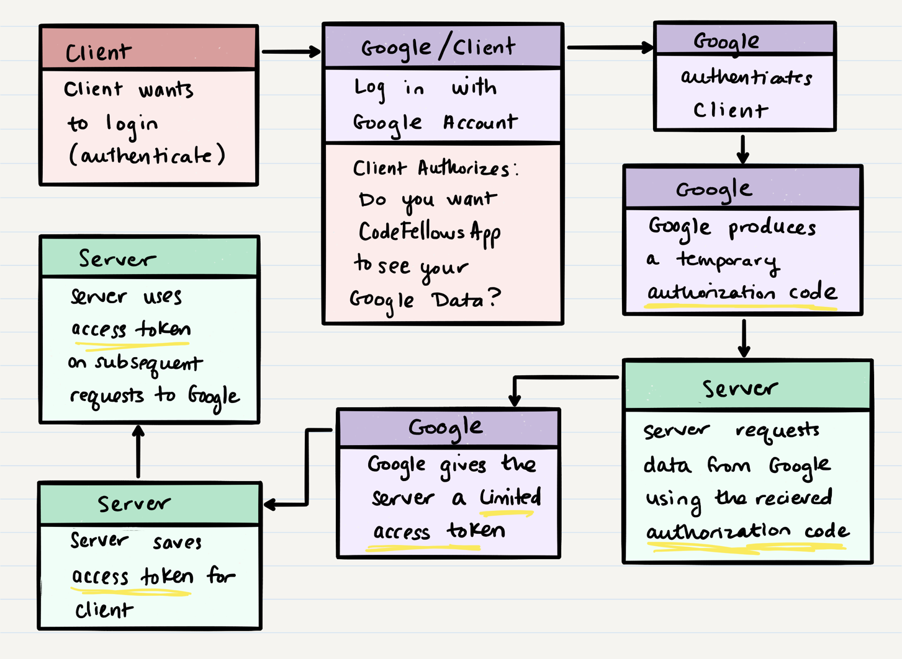

# Class 12 --- OAuth

## Lecture Videos

[Tuesday](https://www.youtube.com/watch?v=xbyHQujvKEo) || [Wednesday](https://www.youtube.com/watch?v=JD7TBLqCPto)

## Lecture Overview

As we continue our Authentication module, we are going to learn about more generalized practices and standards that many applications have implemented. Basic Authentication is great for initial registration and login, but it doesn't provide a secure way to maintain the logged-in status of a user. It can also be tedious for many users to create new usernames and passwords for every website they visit. How can we make this process for our users even more efficient and effortless? The answer comes from using standardized web processes, such as OAuth.

At the end of this class, you'll be able to:

-   [x] Describe the OAuth process
-   [x] Implement OAuth in your own applications
-   [x] Understand the pros and cons of OAuth
-   [x] Understand the security concerns of OAuth

Prior to class, review the readings below and answer the discussion questions in your reading repository.

## Reading

In Class 10, we learned how to implement the simplest form of authentication within our applications. Allowing users to register with a username and password is a fundamental piece of many web applications. But what about web applications that simplify this process even further, allowing users to sign in with an existing Google, Facebook or Twitter account?

These web applications utilize **OAuth**, "an open standard for access delegation". OAuth standardizes how independent web applications can share user data without sharing user passwords. When one web application asks you to sign in via Google, it should never receive your Google account password. Instead, it should receive less sensitive information like your name, email, profile picture, etc.

When you "Login with Google", you're giving the current application some of your personal information imported from Google, as well as a certain access permission to continue to get more information from Google. Generally, sites and apps use this as a simplified way of having you login through one system, but if the permission is granted the application can also do things such as create or delete documents or access other services "as you".

OAuth works through a series of "**handshakes**"; there are multiple layers of requests and responses to get through before you can get the user's data.

Here's an overview of what steps the application goes through:

1. **Client** - Asks to login using a third-party application (Google, Facebook, Twitter, etc.). For the sake of this example, let's assume the client want to login via Google.
1. **Server -> Google** - The server redirects the browser to a page run by Google, which asks the client to confirm that they want to share their data with the server application. This is a full redirect with information sent as query parameters in the URL - at this point you are no longer within your application
1. **Google** - Google reads the query parameters in the URL and ensures their validity. Google then allows the client to "log in" with their Google account.
1. **Google** - Once the client has logged in, Google produces a temporary **authorization code**. It then redirects to the server URL, with the authorization code sent as URL query parameters.
1. **Server** - Now redirected back to the server, the server can save the authorization code in the query parameters. Using this authorization code, the server makes a request to Google, providing this code.
1. **Google** - Google receives this request, and if the authorization code is valid and not tampered with, then Google will provide the server a **limited access token**, which lets the server get some user data, but not all.
1. **Server** - The server receives the access token in a response, and saves it as a reference to the current logged in user.
1. **Server** - The server uses the saved access token to request from Google any user information such as user name, email, profile picture, etc. From this received user data, the server can now store its own user record in its own database, with no unique password being set.

In this process, there are two key items that Google provides to the server (other than the actual user data). These items are the authorization code, and the limited access token. Let's look at what each contains.

The authorization code tells us that the client/user has allowed the server to read data from the user's Google account. In order to get this authorization code, the server needs to actually fully redirect the client to a Google endpoint. When redirecting, the server sends the following information in query parameters, so that the Google endpoint knows how to get back to the server.

| Query Parameter | Description                                                                                                                                                                                                                                                                     | Sample Value            |
| --------------- | ------------------------------------------------------------------------------------------------------------------------------------------------------------------------------------------------------------------------------------------------------------------------------- | ----------------------- |
| `response_type` | A description of what the server is looking for from this Google (or other third-party) endpoint. We typically always want the authorization code.                                                                                                                              | `code`                  |
| `client_id`     | This is something you need to register with Google or the third party you're using. Most of these OAuth third parties require developers to register their server application with the OAuth provider. This registration process results in a `client_id` and a `client_secret` |                         |
| `redirect_uri`  | This tells the Google endpoint (or other third party) how to get back to your server application once an authorization code has been generated                                                                                                                                  | `http://localhost:3000` |
| `scope`         | This tells the Google endpoint (or other third party) what level of access on the user's data you want. Do you want all the data, some of the data, or full read/write permissions?                                                                                             | `user`                  |
| `state`         | This is a generic variable that is meant for the server to send anything it wants to pass along to the Google endpoint (or other third party). This query parameter is not required.                                                                                            |                         |

Once the request to get the authorization code has completed, the server should be able to make another request to Google (or some other third party) to get the user's access token. An access token is basically a "signed in user". Anyone who has an access token can act as an authenticated user, doing any of the actions specified in the `scope` originally provided. Again, these actions are all done through requests from the server to Google's various APIs. When sending these requests, another set of query parameters is required:

| Query Parameter | Description                                                                                                                                                                                                                                                                     | Sample Value            |
| --------------- | ------------------------------------------------------------------------------------------------------------------------------------------------------------------------------------------------------------------------------------------------------------------------------- | ----------------------- |
| `grant_type`    | The secure data you have that should let you get an access token. Typically, this is the authorization code.                                                                                                                                                                    | `authorization_code`    |
| `code`          | This is the actual authorization code you received from the previous handshake step.                                                                                                                                                                                            |                         |
| `redirect_uri`  | This tells the Google endpoint (or other third party) how to get back to your server application once an access token has been generated                                                                                                                                        | `http://localhost:3000` |
| `client_id`     | This is something you need to register with Google or the third party you're using. Most of these OAuth third parties require developers to register their server application with the OAuth provider. This registration process results in a `client_id` and a `client_secret` |                         |
| `client_secret` | This is something you need to register with Google or the third party you're using. Most of these OAuth third parties require developers to register their server application with the OAuth provider. This registration process results in a `client_id` and a `client_secret` |                         |

Through this process, you should receive an access token, which can be used in any future request to get user data. This standardized process is implemented in many large scale applications, so whether your user is signing in via Google, Facebook or Twitter, the process should be essentially the same.

### External Reading / Viewing

Save or skim through the following links to help broaden your understanding.

| Links                                                                                                     |
| --------------------------------------------------------------------------------------------------------- |
| [OAuth2 simplified](https://aaronparecki.com/oauth-2-simplified/)                                         |
| [What is OAuth Really All About?](https://www.youtube.com/watch?v=t4-416mg6iU)                            |
| [OAuth wiki](https://en.wikipedia.org/wiki/OAuth)                                                         |
| [Build a Node API with OAuth](https://developer.okta.com/blog/2018/08/21/build-secure-rest-api-with-node) |

### Vocabulary

Familiarize yourself with the following vocabulary terms.

| Term                    | Definition                                                                                                                                                                                                                                                                                                                                            |
| ----------------------- | ----------------------------------------------------------------------------------------------------------------------------------------------------------------------------------------------------------------------------------------------------------------------------------------------------------------------------------------------------- |
| client ID               | The `client_id` is a public identifier for an application. When you register your application with a third party such as Google, a client ID is produced to refer to your application publicly. You can think of this as your "record id" in the database of registered applications that Google stores.                                              |
| client secret           | The `client_secret` is a hidden string known only to the application and the third party such as Google. You can think of this as your "password" in the database of registered applications that Google stores. With the combination of `client_id` and `client_secret`, you allow Google to know that you're a registered application.              |
| authentication endpoint | This is a URL that any third party OAuth provider has implemented. This page usually allows a user to sign into their third party account, and verify that they want to share data with your server application. Then, a redirect happens back to your server.                                                                                        |
| access token endpoint   | This is an endpoint that any third party OAuth provider has implemented. Making a request to this endpoint should provide you with an access token for the signed-in user.                                                                                                                                                                            |
| API endpoint            | This is any endpoint that a third party OAuth provider has implemented. We say "API endpoint" typically when we refer to an endpoint that gives us user data or lets us do some user action. This is different from the "authentication endpoint" and "access token endpoint", which are part of the sign-in process and don't give actual user data. |
| authorization code      | This is a code that allows a server application to request an access token. It is generated from the authentication endpoint, after a user has signed-in and verified that your server application has permission.                                                                                                                                    |
| access token            | This is a token that represents a signed in user on a third party application. With this token, you can request from an API endpoint to get user data or carry out user actions.                                                                                                                                                                      |
| OAuth                   | An open standard for access delegation - this is a standard way for independent applications to share sensitive user data.                                                                                                                                                                                                                            |

## Discussion Questions

Create a new markdown page in your reading notes repo for this class. On that page, answer the following questions. You will not be graded on correctness, but rather on your attempt to answer the question. Once you've created your new page, submit a link to that page using the canvas discussion entry field. Links should be somewhat of the format `https://USERNAME.github.io/reading-notes/class-##-reading`.

1. What's a benefit of using OAuth instead of your own basic authentication?
2. Write the following steps in the correct order:
    - Receive access token
    - Redirect to a third party authentication endpoint
    - Register your application to get a `client_id` and `client_secret`
    - Make a request to a third-party API endpoint
    - Ask the client if they want to sign in via a third party
    - Receive authorization code
    - Make a request to the access token endpoint
3. What can you do with an authorization code?
4. What can you do with an access token?
