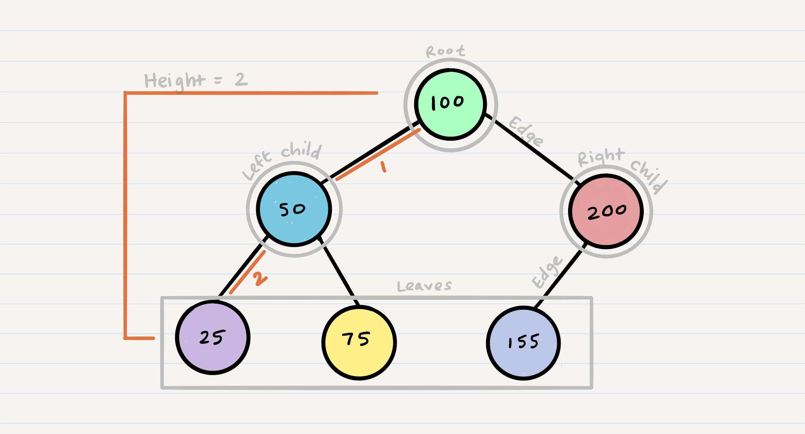
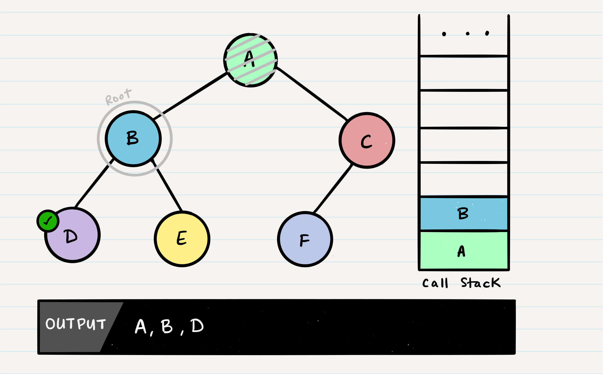
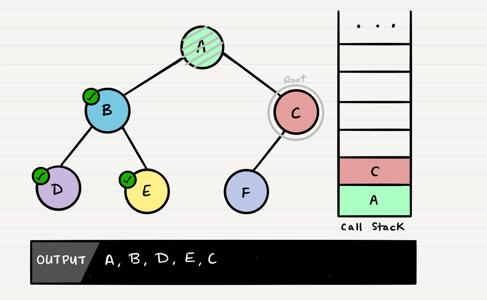
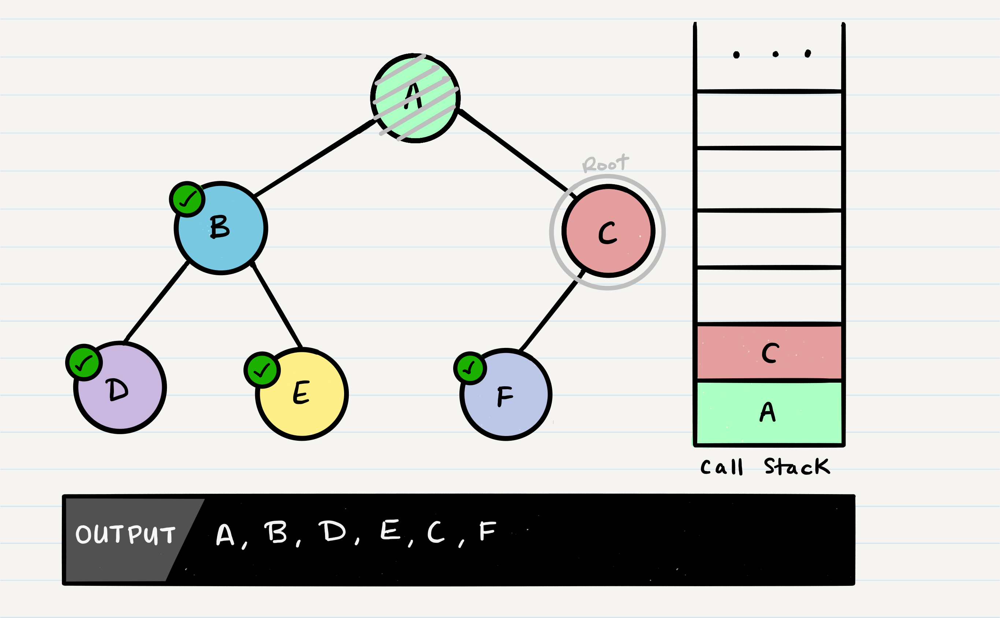
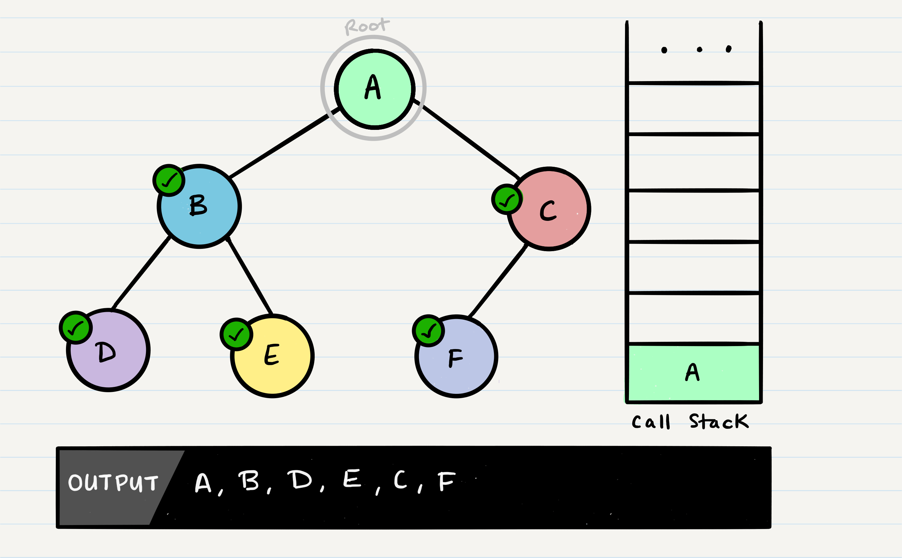

# Class 15 --- DSA: Trees

## Lecture Videos

[Saturday Morning](https://www.youtube.com/watch?v=ZFa6sBooLl0) || [Saturday Afternoon](https://www.youtube.com/watch?v=IdRDyKQja9o)

## Lecture Overview

We've now reached the end of our Auth/Auth module, which covered some of the standard ways to handle authentication and authorization in a web application. Using three major authorization methods (Basic, Bearer and OAuth) you can securely recieve credentials from a user and verify their identity. As we review those topics today, we'll also be covering a new data structure, trees. 

At the end of this class, you'll be able to:

-   [x] Define what a data structure is
-   [x] Define what a tree is
-   [x] Understand the difference between preOrder, postOrder and inOrder traversal
-   [x] Understand breadth first traversal using a queue
-   [x] Understand the difference between a binary tree and a binary search tree\
-   [x] Have a solid understanding of past module topics such as:
    -   [x] Sign in and sign up using Basic Auth
    -   [x] Taking user data from a third party using OAuth
    -   [x] The use of Bearer tokens 
    -   [x] How to generate a token using JWT 
    -   [x] Role based access control to protect data / routes

Prior to class, review the readings below and answer the discussion questions in your reading repository.

## Reading

A **tree** is a very useful data structure for efficient storing, sorting and serching.

Here's an example of what a tree looks like. As you can see, the topmost item is denoted as the `root`. Each `Node` branches into two paths, a `left` child and a `right` child. Note that trees can have any number of "branches", but we are usually interested in trees with only two branches per `Node`, called a **binary tree**. 



Common terminology for a binary tree is

-   `root` - The first or starting `Node` of the tree. Everything branches from this `Node`
-   `left` - The **left child** is the `Node` to the left of a parent `Node`
-   `right` - The **right child** is the `Node` to the right of a parent `Node`
-   **edge** - An edge is a connection between two `Nodes`. In code, this is not really phyically represented, it's just a representation of the references between a parent `Node` and the child `Node`.
-   **leaf** - A leaf `Node` is a `Node` without any subsequent edges / connections
-   **height** - The height of a tree is the number of `Node` "levels" it has, usually counted via the number of edges from top to bottom. 

An important aspect of trees is how to traverse them. Traversing a tree allows us to search for a `Node`, print out the contents of a tree, and much more! There are two categories of traversals when it comes to trees:

- Depth First Traversal
- Breadth First Traversal

**Depth first traversal** is where we prioritize going through the depth (height) of the tree first. There are multiple ways to carry out depth first traversal, and each method changes the order in which we search/print the `root`. Here are three methods for depth first traversal:

- Pre-order: `root >> left >> right`
- In-order: `left >> root >> right`
- Post-order: `left >> right >> root`


Given the sample tree above, our traversals would result in different paths:

- _Pre-order:_ `root >> left >> right` results in `A, B, D, E, C, F`
- _In-order:_ `left >> root >> right` results in `D, B, E, A, F, C`
- _Post-order:_ `left >> right >> root` results in`D, E, B, F, C, A`

The most common way to traverse through a tree is to use **recursion**. With these traversals, we rely on the **call stack** to navigate back up the tree.

Let's break down the pre-order traversal. Here is the pseudocode for this traversal method:

```javascript
ALGORITHM preOrder(root)

  OUTPUT <-- root.val

  if root.left is not NULL
      preOrder(root.left)

  if root.right is not NULL
      preOrder(root.right)

```

Pre-order means that the `root` has to be looked at first. In our case, looking at the root just means that we output its value. When we call `preOrder` for the first time, the `root` will be added to the call stack:


Next, we start reading our `preOrder` function's code from top to bottom. The first line of code reads this:

```
OUTPUT <-- root.val
```

This means that we will output the `root.val` out to the console. Then, our next block of code instructs us to check if our `root` has a `left` node set. If the root does, we will then send the `left` node to our `preOrder` method recursively. This means that we make another function call, where `B` is our new `root`:


This process continues until we reach a leaf node. Here's the state of our tree when we hit our first leaf, `D`:


It's important to note a few things that are about to happen:

- The program will look for both a `root.left` and a `root.right`. Both will return `null`, so it will end the execution of that method call
- `D` will _pop_ off of the call stack and the `root` will be reassigned back to `B`
  - This is the heart of recursion: when we complete a function call, we pop it off the stack and are able to continue execution through the previous function call



The code block will now pick up where it left off when `B` was the root. Since it already looked for `root.left`, it will now look for `root.right`.


`E` will output to the console. Since `E` is a leaf, it will complete the method code block, and pop `E` off of the call stack and make its way back up to `B`.


In the function call, `B` has already checked for `root.left`, and `root.right`. There are no further lines of code to execute, so `B` will be popped off the call stack, so that we can resume execution of `A`.


Following the same pattern as we did with the other nodes, `A`'s call stack frame will pick up where it left off, and check out `root.right`. `C` will be added to the call stack frame, and it will the new function's `root`.



`C` will be outputted to the console, and `root.left` will be evaluated. Because `C` has a left child, `preOrder` will be called, with the parameter `root.left`.


At this point, the program will find that `F` does not have any children and it will make its way back up the call stack up to `C`.



`C` does not have a `root.right`, so it will pop off the call stack and return to `A`.



Congratulations! Your pre-order traversal is completed! All three different traversals within depth first search are quite similar. The biggest difference between each of the traversals is _when you are looking at the root node_.

**Breadth first traversal** iterates through the tree by going through each level of the tree node-by-node. So, given our starting tree one more time:


Our output using breadth first traversal would be:

* *Breadth First Output:* `A, B, C, D, E, F`

Traditionally, breadth first traversal uses a queue (instead of a call stack) to traverse the width/breadth of the tree. Let's break down the process.

Given our starting tree shown above, let's start by putting the `root` into the queue:


Now that we have one node in our queue, we can `dequeue` it and use that node in our code.


From our dequeued node `A`, we can `enqueue` the `left` and `right` child (in that order).


This leaves us with `B` as the new front of our queue. We can then repeat the process we did with `A`: Dequeue the front node, enqueue that node's `left` and `right` nodes, and move to the next new front of the queue.


Now our front is `C`, so we repeat the dequeue + enqueue children process:


And we continue onwards. When we reach a node that doesn't have any children, we just dequeue it without any further enqueue.


Here is the pseudocode, utilizing a built-in queue to implement a breadth first traversal.

```javascript
ALGORITHM breadthFirst(root)
// INPUT  <-- root node
// OUTPUT <-- front node of queue to console

  Queue breadth <-- new Queue()
  breadth.enqueue(root)

  while breadth.peek()
    node front = breadth.dequeue()
    OUTPUT <-- front.value

    if front.left is not NULL
      breadth.enqueue(front.left)

    if front.right is not NULL
      breadth.enqueue(front.right)
```

Now that we've covered traversals, what about sorting and serching? There is no default sorting order for a binary tree; Nodes can be added into a binary tree wherever space allows. Here is what a binary tree may look like:


Because there are no structural rules for where nodes are "supposed to go" in a binary tree, it really doesn't matter where a new node gets placed.

One strategy for adding a new node to a binary tree is to fill all "child" spots from the top down. To do so, we would leverage the use of breadth first traversal. During the traversal, we find the first node that does not have 2 child nodes, and insert the new node as a child. We fill the child slots from left to right.

In the event you would like to have a node placed in a specific location, you need to reference both the new node to create, and the parent node upon which the child is attached to.

The Big O time complexity for inserting a new node is `O(n)`. Searching for a specific node will also be `O(n)`. Because of the lack of organizational structure in a Binary Tree, the worst case for most operations will involve traversing the entire tree. If we assume that a tree has `n` nodes, then in the worst case we will have to look at `n` items, hence the `O(n)` complexity.

The Big O space complexity for a node insertion using breadth first insertion will be `O(w)`, where `w` is the largest width of the tree. For example, in the above tree, `w` is 4.

A "perfect" binary tree is one where every non-leaf node has exactly two children. The maximum width for a perfect binary tree, is `2^(h-1)`, where `h` is the height of the tree. Height can be calculated as `log n`, where `n` is the number of nodes.

A **Binary Search Tree (BST)** is a type of tree that does have some structure attached to it. In a BST, nodes are organized in a manner where all values that are smaller than the `root` are placed to the left, and all values that are larger than the `root` are placed to the right.

Here is how we would change our Binary Tree example into a Binary Search Tree:


Searching a BST can be done quickly, because all you do is compare the node you are searching for against the root of the tree or sub-tree. If the value is smaller, you only traverse the left side. If the value is larger, you only traverse the right side.

Let's say we are searching `15`. We start by comparing the value `15` to the value of the root, `23`.

* `15 < 23`, so we traverse the left side of the tree. We then treat `8` as our new "root" to compare against.

* `15 > 8`, so we traverse the right side. `16` is our new root.

* `15 < 16`, so we traverse the left side. And aha! `15` is our new root and also a match with what we were searching for.


The best way to approach a BST search is with a `while` loop. We cycle through the while loop until we hit a leaf, or until we reach a match with what we're searching for.

The Big O time complexity of a Binary Search Tree's insertion and search operations is `O(h)`, or `O(height)`. In the worst case, we will have to search all the way down to a leaf, which will require searching through as many nodes as the tree is tall. In a balanced (or "perfect") tree, the height of the tree is `log(n)`. In an unbalanced tree, the worst case height of the tree is `n`.

The Big O space complexity of a BST search would be `O(1)`. During a search, we are not allocating any additional space.

### External Reading / Viewing

Save or skim through the following links to help broaden your understanding.

| Links |
| ----- |
|       |
|       |
|       |

### Vocabulary

Familiarize yourself with the following vocabulary terms.

| Term                    | Definition |
| ----------------------- | ---------- |
| tree                    |            |
| binary tree             |            |
| root                    |            |
| parent                  |            |
| child                   |            |
| edge                    |            |
| height                  |            |
| left child              |            |
| right child             |            |
| Depth-First Traversal   |            |
| Breadth-First Traversal |            |
| recursion               |            |
| binary search tree      |            |
| k-ary tree              |            |

### Handy Code Snippets

Feel free to skim these code snippets, they are mainly here for your reference after class lectures.

#### Pre-Order Traversal

```javascript
ALGORITHM preOrder(node)
// INPUT <-- root node
// OUTPUT <-- pre-order output of tree nodes

    OUTPUT <-- node.val

    if node.left is not Null
        preOrder(node.left)

    if node.right is not NULL
        preOrder(node.right)
```

### In-Order Traversal

```javascript
ALGORITHM inOrder(node)
// INPUT <-- root node
// OUTPUT <-- in-order output of tree nodes

    if node.left is not NULL
        inOrder(node.left)

    OUTPUT <-- node.val

    if node.right is not NULL
        inOrder(node.right)
```

#### Post-Order Traversal

```javascript
ALGORITHM postOrder(node)
// INPUT <-- root node
// OUTPUT <-- post-order output of tree nodes

    if node.left is not NULL
        inOrder(node.left)

    if node.right is not NULL
        inOrder(node.right)

    OUTPUT <-- node.val
```

#### Breadth-First Traversal

```javascript
ALGORITHM breadthFirst(root)
// INPUT  <-- root node
// OUTPUT <-- front node of queue to console

  Queue breadth <-- new Queue()
  breadth.enqueue(root)

  while breadth.peek()
    node front = breadth.dequeue()
    OUTPUT <-- front.val

    if front.left is not NULL
      breadth.enqueue(front.left)

    if front.right is not NULL
      breadth.enqueue(front.right)
```

## Discussion Questions

Create a new markdown page in your reading notes repo for this class. On that page, answer the following questions. You will not be graded on correctness, but rather on your attempt to answer the question. Once you've created your new page, submit a link to that page using the canvas discussion entry field. Links should be somewhat of the format `https://USERNAME.github.io/reading-notes/class-##-reading`.

1. What is a leaf node? Why is it important to be able to find leaf nodes? 
2. Describe the differences between pre-order, in-order, and post-order traversal. Why are they called pre,  in, and post order? 
3. What is the height of a fully balanced (each non-leaf node has two children) tree? What is this used for? 
4. How are stacks and queues used in relation to trees? 


