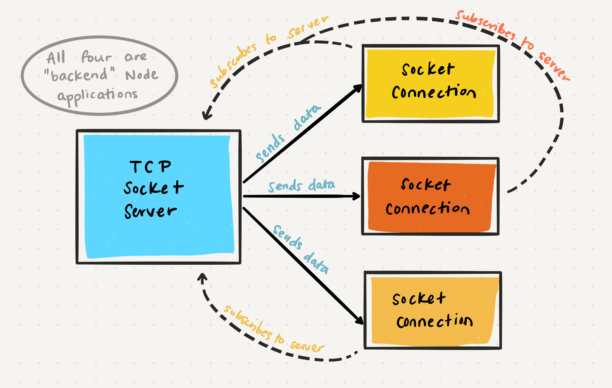

# Class 17 --- TCP Server

## Lecture Videos

[Saturday Morning P1](https://www.youtube.com/watch?v=Oo5HObN8AP8) || [Saturday Morning P2](https://www.youtube.com/watch?v=nVLvcGGn6GM) || [Saturday Afternoon](https://www.youtube.com/watch?v=T1JhVHGk-RA)

## Lecture Overview

In a previous module, we learned about HTTP, the HyperText Transfer Protocol. In this class, we'll be learning about a new kind of protocol, the **Transmission Control Protocol**, or **TCP**. This protocol is used for server-to-server communication, whereas HTTP is typically client-to-server communication. 

At the end of this class, you'll be able to:

-   [x] Define the OSI Networking Model
-   [x] Understand the TCP and UDP protocols
-   [x] Understand stateful networking
-   [x] Define what a "packet" is
-   [x] Understand buffered transfer
-   [x] Create a TCP server
-   [x] Simulate events through curated messages 

Prior to class, review the readings below and answer the discussion questions in your reading repository.

## Reading

In our last class, we emitted events that could be listened to in any file of our application. But how can you respond to events coming from an *external* application? Just like the client-to-server communication with HTTP, you can have two independent server applications communicate via another protocol, TCP. Generally, this is done by using a central "operator" server which receives all inbound messages and directs those messages to any connected subscribers/listeners.

Whenever two independent systems communicate, we have to provide a series of rules and structure so that security is ensured and both applications know what to do at each step of the process. There are many collections of rules we could follow, but a standard set is the **Open Systems Interconnection Reference Model**, or **OSI**. This is a seven-layer procedure for what protocols to use when transferring data. 

| #    | Layer        | Description                                                  | Protocol Examples    |
| ---- | ------------ | ------------------------------------------------------------ | -------------------- |
| 7    | Application  | User action or application action initiates some data transfer (either a request or a response). Data asks to be sent from the current application (origin) to another URL (endpoint). | HTTP, IMAP, POP, SSH |
| 6    | Presentation | Before data is sent, we need to make sure it looks correct so that it can be understood by anyone. In this step, data is encrypted, encoded, compressed or transformed to make it easier to transfer. |                      |
| 5    | Session      | Before data is sent, we need to make sure that we are able to connect to the endpoint. This step attempts to establish a connection with the endpoint using any required credentials |                      |
| 4    | Transport    | The data that is being sent from origin to endpoint is broken up into small **packets** of 1 Kilobyte each. This makes it easy to send data quickly and efficiently. When the data is broken up into packets, each packet gets a header that specifies how to reassemble the packets into the original full data. | TCP, UDP             |
| 3    | Network      | Individual packets are then marked with the endpoint's IP address. This is a more detailed location than a simple URL. Now that the packets are marked with where they should go, packets can be sent individually instead of as a group. The Network layer also determines the best routes for each packet to use when traveling from origin to endpoint. | IP, ICMP             |
| 2    | Data Link    | The most complex of the layers, this layer handles the actual bit-by-bit transmission of data from the origin to the endpoint. | Ethernet, WiFi       |
| 1    | Physical     | This layer is the actual physical device that is receiving or sending data. This could be a modem that is maintaining your WiFi connection, an Ethernet cord plugged into your machine, a Bluetooth device that is receiving data, etc. Any issues in these physical cables or devices can interrupt the data transfer. This is why there is the famous phrase "have you tried turning it off and on again?" |                      |

The OSI model is very detailed, and sometimes certain layers don't apply. For example, in a server-to-server connection, we don't need the presentation or session layer; we assume the application will have already done that for us. So, while the OSI model is very good to know, we often instead use a simpler model for internet data transfer, called the **Internet Protocol Suite**: 

| #    | Layer       | Description                                                  | Protocol Examples    |
| ---- | ----------- | ------------------------------------------------------------ | -------------------- |
| 4    | Application | User action or application action initiates some data transfer (either a request or a response). Data asks to be sent from the current application (origin) to another URL (endpoint). | HTTP, IMAP, POP, SSH |
| 3    | Transport   | The data that is being sent from origin to endpoint is broken up into small **packets** of 1 Kilobyte each. This makes it easy to send data quickly and efficiently. When the data is broken up into packets, each packet gets a header that specifies how to reassemble the packets into the original full data. | TCP, UDP             |
| 2    | Internet    | Individual packets are then marked with the endpoint's IP address. This is a more detailed location than a simple URL. Now that the packets are marked with where they should go, packets can be sent individually instead of as a group. The Network layer also determines the best routes for each packet to use when traveling from origin to endpoint. | IP, ICMP             |
| 1    | Link        | The most complex of the layers, this layer handles the actual bit-by-bit transmission of data from the origin to the endpoint. | Ethernet, WiFi       |

This protocol suite is often referred to as **TCP/IP** because the TCP and IP protocols are the fundamental pieces of the process (layer 3 and 2). 


Now that we know generally the steps data takes when being transferred between independent systems, let's narrow our focus on the actual transport layer, which uses either the **TCP** or **UDP** protocols. This transport layer is primary what server-to-server connections utilize when HTTP is overkill - many times the servers don't have "clients" or endpoints that are accessible by any frontend applications, so HTTP is an unneeded layer. 

Both TCP and UDP follow a similar pattern - they break up the data that a server is sending into small **packets**. These packets are about one kilobyte in size, so that they're easy to send over the internet. Within each packet there are two major segments of information: 

* The **header**, which contains information about where the packet came from, where its going, and how it should be reassembled with other packets.
* The **segmented data**, which is a peice of a greater whole. This data doesn't really make sense on its own, but should be combined with data from other packets. 

The major difference between TCP and UDP is the amount of information stored in the header. Typically, TCP headers are more detailed and verbose, whereas UDP headers are lightweight. **UDP (User Datagram Protocol)** is less secure; when transferring data it doesn't establish a strong secure connection between the sending server and the receiving server. TCP, however, continually maintains a sercure connection link while all the packets are being sent over. 

A use case for TCP would be when you're sending an image file that needs all the packets to successfully reach the receiver and be quickly reassembled. 

A use case of UDP would be when a server is continually sending another server some simple information (like a temperature reader sending the current temperature to a server application). In this situation, it doesn't matter if any packets get lost in transmission or don't arrive at the right time; each packet isn't dependent on other packets. 

Here's how the headers differ between TCP and UDP. TCP headers are typically 160 bits (20 bytes) long, whereas UDP headers are typically only 64 bits (8 bytes) long.

#### TCP

| Position  | Length in Bits | Name                                   | Description                                                  |
| --------- | -------------- | -------------------------------------- | ------------------------------------------------------------ |
| 0-15      | 16             | Source port                            | This is a port address for the origin *application*. We are familiar with IP addresses, which is an address for a *device*. Multiple applications can run on a device, and each runs on a specific Port. The source port number typically ranges from 1024-65535 (we run our localhost applications on 3000). |
| 16-31     | 16             | Destination port                       | This is a port for our destination application, and it usually is a well known number in the range of 0 - 1023. For example, most website applications using HTTP run on port 80. |
| 32 - 63   | 32             | Sequence number                        | This is a value used to keep track of all the packets in the data, and to figure out how to reassemble the packets in the correct order. |
| 64 - 95   | 32             | Acknowledgment number                  | This is the sequence number for the next packet in the correct packet assembly order. Usually, this is just the sequence number plus one. |
| 96 - 99   | 4              | Data offset                            | This indicates the length of the TCP header so we know when the header ends and the packet contents begins. |
| 100 - 102 | 3              | Reserved value                         | This is a reserved collection of bits in the header that we never modify; they are usually just three bits set to 0 |
| 103       | 1              | `NS` flag                              | An experimental feature for a *nonce sum*: a random cryptographic number used to prevent people from lying about who they are. Most of the time, this flag is unused and set to 0 |
| 104       | 1              | `CWR` flag                             | Used to mark that a previous packet had its `ECE` flag set.  |
| 105       | 1              | `ECE` flag                             | Typically used to mark that the current packet was hit with network congestion / slowdown. |
| 106       | 1              | `URG` flag                             | This is an urgent pointer. When this flag is set to true, the current packet should be treated as a higher priority over other data. |
| 107       | 1              | `ACK` flag                             | This flag specifies that the acknowledgment number field is set, meaning that there are more packets to fetch for this data |
| 108       | 1              | `PSH` flag                             | This flag specifies that, if true, the current packet should be transmitted immediately, without waiting for other packets to load. |
| 109       | 1              | `RST` flag                             | While not commonly used, this flag when set as true notifies the endpoint to terminate the data connection after it receives the current packet. This is only used when there are unrecoverable errors and it’s not a normal way to finish the TCP connection. |
| 110       | 1              | `SYN` flag                             | This flag indicates if this is the first packet in the data stream. |
| 111       | 1              | `FIN` flag                             | This flag indicates if this is the last packet in the data stream. Indicates that after receiving this packet, we should close the connection. |
| 112 - 127 | 16             | Window size                            | This specifies how many bytes the endpoint receiver is willing to receive. This is to ensure that we're not sending data that is too large for the endpoint to handle. |
| 128 - 143 | 16             | Checksum                               | This is a generated value that verifies that the TCP header is of the correct format and doesn't have an dangerous content |
| 144 - 159 | 16             | Urgent Pointer (if `URG` flag is true) | If the `URG` flag is set, this data is used to determine where the urgent data ends |
| 160 - ... | variable       | Additional options                     | This field is optional and can be anywhere from 0 to 320 bits. |

#### UDP

| Position | Length in Bits | Name             | Description                                                  |
| -------- | -------------- | ---------------- | ------------------------------------------------------------ |
| 0-15     | 16             | Source port      | This is a port address for the origin *application*. We are familiar with IP addresses, which is an address for a *device*. Multiple applications can run on a device, and each runs on a specific Port. The source port number typically ranges from 1024-65535 (we run our localhost applications on 3000). |
| 16 - 31  | 16             | Destination port | This is a port for our destination application, and it usually is a well known number in the range of 0 - 1023. For example, most website applications using HTTP run on port 80. |
| 32 - 47  | 16             | Length           | This indicates the length of the UDP header and the UDP data. |
| 48 - 63  | 16             | Checksum         | This is a generated value that verifies that the TCP header is of the correct format and doesn't have an dangerous content |

We can have our server applications use TCP data transfer by utilizing the built in Node `net` module. In order to successfully implement this data flow, we will need at least two running server applications. The first will be the **TCP Socket Server**, which is what sends the data out for others to receive. The second will be the **TCP Socket Connection**, which is what subscribes as a listener and receives data from the first socket server. Both are "server-side" applications, though only one is typically "serving out" data for the second to consume. Note that there can be multiple socket connections listening in on a single socket server. 



In this class, we'll explore how to create our two applications and have them communicate via TCP. 

### External Reading / Viewing

Save or skim through the following links to help broaden your understanding.

| Links                                                        |
| ------------------------------------------------------------ |
| [OSI Model Explained](https://www.youtube.com/watch?v=vv4y_uOneC0) |
| [TCP Handshakes Explained](https://www.youtube.com/watch?v=xMtP5ZB3wSk) |
| [OSI Model](https://www.cloudflare.com/learning/ddos/glossary/open-systems-interconnection-model-osi/) |
| [What is TCP](https://searchnetworking.techtarget.com/definition/TCP) |
| [Build a TCP Server (code only)](https://techbrij.com/node-js-tcp-server-client-promisify) |
| [Net Module Documentation](https://nodejs.org/api/net.html)  |

### Vocabulary

Familiarize yourself with the following vocabulary terms.

| Term              | Definition                                                   |
| ----------------- | ------------------------------------------------------------ |
| OSI Model         | The Open Systems Interconnection model is a conceptual model that describes the process of transferring data from source to destination. Each layer of the model feeds into the next layer, and each layer specifies some common protocols to use at that step of the process. |
| TCP/IP Model      | The Internet Protocol Suite, or the TCP/IP model, is a simplified version of the OSI model, specifically suited for data transfer between internet applications. |
| TCP               | The Transmission Control Protocol is a reliable way to transport packets of data over the internet. TCP is connection-oriented, and a connection between the source and destination is established before data can be sent. |
| UDP               | The User Datagram Protocol is a simple connectionless communication between the source and destination, so there is no guarantee of delivery. This can be beneficial in some cases, since UDP avoids some overhead time that TCP relies on. |
| packets           | A kilobyte of information that represents a piece of a larger data stream. All packets have a header. |
| header            | The packet header provides valuable information about the packet, the source application and the destination application. This information can be used to verify packet security, reassemble multiple packets into the original data stream, and more! |
| socket server     | A TCP socket server is an application that sends data to other applications. |
| socket connection | A TCP socket connection is an application that subscribes to and receives data from a TCP socket server. |

### Handy Code Snippets

Feel free to skim these code snippets, they are mainly here for your reference after class lectures.

#### Create a Socket Server

```javascript
const net = require('net'); 
const server = net.createServer(); 
let connectedSockets = []; 

// start the server 
server.listen(port, () => {
  console.log('Server up and running on port', port); 
}); 

// listen for other applications to connect to this server
server.on('connection', socket => {
  console.log(socket, 'has connected to this server'); 
  connectedSockets.push(socket); 
}); 
```

#### Create a Socket Connection

```javascript
const net = require('net'); 
const socket = new net.Socket(); 

socket.connect({ port: 3000, host: 'localhost' }, () => {
  console.log('Connected to the server on localhost:3000'); 
}); 
```

#### Sending Data from a Socket Server to a Socket Connection

```javascript
// server
let destinationSocket = connectedSockets[0]; 
destinatoinSocket.write('Here is some data I am sending'); 
```

```javascript
// connection
socket.on('data', payload => {
  console.log('Received:', payload); 
});
```

## Discussion Questions

Create a new markdown page in your reading notes repo for this class. On that page, answer the following questions. You will not be graded on correctness, but rather on your attempt to answer the question. Once you've created your new page, submit a link to that page using the canvas discussion entry field. Links should be somewhat of the format `https://USERNAME.github.io/reading-notes/class-##-reading`.

1. What do the layers in the OSI and TCP/IP models represent? 
2. What is the benefit of transforming data into packets? 
3. UDP is often referrered to as a *connectionless* protocol. Why is this? 
4. Can a socket server application have multiple socket connections? Can a socket connection application be connected to multiple socket servers? Can an application be both a socket server and a socket connection? 