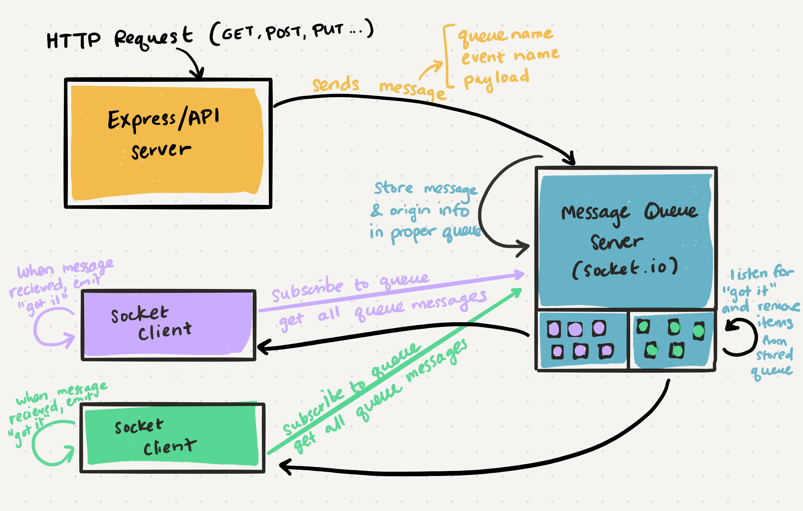

# Class 19 --- Message Queues

## Lecture Videos

[Saturday Morning](https://www.youtube.com/watch?v=ZKsxKhc_skM) || [Saturday Afternoon](https://www.youtube.com/watch?v=1o2UrhI4MhE)

## Lecture Overview

So far, we've used `socket.io` to create a complex mutli-application communication network, where actions are relayed via events. Now, we're going to connect our socket application to an express server, allowing us to use HTTP routes to kick off a TCP connection. 

At the end of this class, you'll be able to:

-   [x] Define messaging queues, ordered and unordered
-   [x] Understand the architecture for a message queue server
-   [x] Build an event-based messaging server
-   [x] Manage a subscription/event queue

Prior to class, review the readings below and answer the discussion questions in your reading repository.

## Reading

In our prior lab assignment, we had three independent applications running and communicating with each other over TCP, with `socket.io` maintaining the communication connection via HTTP. Now, we're going to add a **message queue server** to the mix! 

A message queue server (or simply, queue server) runs independently and is tasked with routing events and messaging between clients. Any connected client can publish a message to the server, or subscribe to certain types of messages. So in our previous assignment, we had the socket server and socket clients define what events they are listening to. Now, we're going to centralize some of that logic to our queue server. This makes it easier to grow our application, and it means our clients can be even more lightweight. 

Moreover, a queue server makes sure that all connected clients are up to date with the data they need. Subscribed clients can now "catch up" and pull down any events (or **messages**). they may have missed while disconnected. For example, if you're creating a chat application,  you may want to load your chat history whenever you start up the application, instead of only being able to see current new messages. 

When having a queue server, we don't send "events" around to our clients anymore. Instead, we send *messages*. A message contains a queue name, event name and payload, so it really is just an extension on our events. The queue name refers to the general category the message belongs to, for example "network", "database", "files", "orders", etc. 

The queue name is useful because it allows certain clients to only subscribe to a single queue instead of all queues. So if my particular client only wants to hear "orders" related events, it would subscribe to the "orders" queue. 

Let's break down some of the communication paths in the above diagram. 

* Things start at the Express server, also called the API server. This is where someone makes a request that will trigger a message to be created and sent to the message queue server. 
  * In CSPS, this might be an HTTP request to POST a "delivery", which triggers a `delivered` event
* When the Message Queue Server receives a message, it stores it in the proper queue. Often, it will also store information about where the message originated from. 
* The multiple (and individual) socket clients will subscribe to a queue when they start up. They will then request to get all the queue messages that are currently stored.
* One by one, as the socket client reads a message sent from the server, it will emit some event that marks that message as "seen". The message queue server will then delete that message from the stored queue.  

In the past few assignments, we have been working with "real-time" messaging systems. If any clients disconnect, they will potentially miss events. With message queues, we can solve this issue. The individual queues will keep track to the delivery status of every message, and anything that is not delivered will remain in the queue until it can be delivered. Clients will then "poll" or ask the server for any messages in the queue they care about. 

### External Reading / Viewing

Save or skim through the following links to help broaden your understanding.

| Links                                                        |
| ------------------------------------------------------------ |
| [Rooms and Namespaces](https://socket.io/docs/rooms-and-namespaces/) |
| [Socket.io Emit Cheatsheet](https://socket.io/docs/emit-cheatsheet/) |
| [Messaging Queues \| System Design Basics](https://www.youtube.com/watch?v=sfQwMu0SCT8) |

## Discussion Questions

Create a new markdown page in your reading notes repo for this class. On that page, answer the following questions. You will not be graded on correctness, but rather on your attempt to answer the question. Once you've created your new page, submit a link to that page using the canvas discussion entry field. Links should be somewhat of the format `https://USERNAME.github.io/reading-notes/class-##-reading`.

1. What is the main benefit of a message queue server? 
2. Why might we want to initiate messages from an HTTP request? 
3. Is the Message Queue Server a socket.io client, a socket.io server, or an api server?
